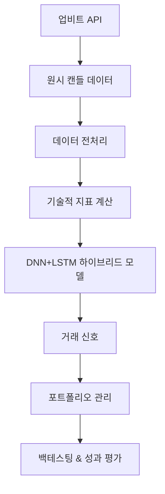

# 🏗️ DNN+LSTM 하이브리드 시스템 아키텍처

## 📊 전체 시스템 플로우



## 🧠 신경망 아키텍처 상세

```
📥 입력 레이어
│
├── 기술적 지표 (12개)
│   ├── 이동평균: ma5, ma20, ma60
│   ├── 모멘텀: rsi, macd, macd_signal, macd_hist  
│   ├── 볼린저밴드: bb_ratio
│   ├── 거래량: volume_ratio
│   └── 가격변화: price_change, price_change_5, price_change_20
│
└── 에이전트 상태 (3개)
    ├── 보유 비율 (0.0~1.0)
    ├── 현재 손익률 
    └── 평균매수가 대비 등락률

📊 시계열 변환 (LSTM용)
│
├── 시간 t-4: [15개 특성]
├── 시간 t-3: [15개 특성]  
├── 시간 t-2: [15개 특성]
├── 시간 t-1: [15개 특성]
└── 시간 t-0: [15개 특성]
         ↓ shape: (5, 15)

🧠 DNN 특성 추출 블록
│
├── Dense(256) + Sigmoid + BatchNorm + Dropout(0.1)
│    ↓ 고차원 특성 추출
└── Dense(128) + Sigmoid + BatchNorm + Dropout(0.1)
         ↓ 압축된 특성

⏳ LSTM 시계열 분석 블록  
│
├── LSTM(64, return_sequences=True) + BatchNorm + Dropout(0.1)
│    ↓ 장기 의존성 학습
└── LSTM(32, return_sequences=False) + BatchNorm + Dropout(0.1)
         ↓ 최종 시계열 특성

🎯 출력 레이어
│
└── Dense(3) + Linear/Softmax
    │
    ├── Q(매수) = 45.2
    ├── Q(매도) = 12.8  
    └── Q(관망) = 38.5
         ↓
    argmax → 행동 선택 (매수)
```

## 📁 프로젝트 구조

```
auto-trader/
│
├── model/                              # 🧠 AI 모델 코어
│   ├── crypto_rl_learner.py           # 메인 강화학습 엔진
│   ├── crypto_rl_agent.py             # 거래 의사결정 에이전트  
│   ├── crypto_rl_environment.py       # 거래 환경 시뮬레이션
│   ├── train_crypto_rl_hybrid.py      # 하이브리드 모델 학습
│   ├── predict_hybrid_signals.py      # 하이브리드 모델 예측
│   ├── README_HYBRID_MODEL.md         # 📖 상세 가이드
│   ├── QUICKSTART.md                  # ⚡ 빠른 시작 가이드
│   └── crypto_rl_models/              # 💾 학습된 모델 저장소
│       ├── value_network_*.weights.h5  # 신경망 가중치
│       └── training_summary_*.json     # 학습 결과 요약
│
├── quantylab/                          # 🔬 신경망 프레임워크
│   ├── networks/
│   │   ├── __init__.py
│   │   └── networks_keras.py          # DNN, LSTM, CNN, DNNLSTMNetwork
│   ├── agent.py                       # 기본 에이전트
│   ├── environment.py                 # 기본 환경
│   └── visualizer.py                  # 시각화 도구
│
├── module/                             # 🔧 유틸리티 모듈
│   └── crypto/
│       └── crypto_data_manager.py     # 업비트 API 데이터 관리
│
└── data/                              # 📊 데이터 저장소
    ├── crypto_data.db                 # SQLite 캐시 DB
    └── crypto_cache/                  # 캔들 데이터 캐시
```

## 🔄 데이터 플로우 상세

### 1. 데이터 수집 및 전처리
```python
# 1단계: 업비트 API → 원시 캔들 데이터
raw_data = {
    'candle_date_time_utc': '2025-08-21T00:00:00+00:00',
    'opening_price': 157500000.0,
    'high_price': 159000000.0, 
    'low_price': 156800000.0,
    'trade_price': 158316000.0,
    'candle_acc_trade_volume': 1234.56789
}

# 2단계: 기술적 지표 계산
technical_indicators = {
    'ma5': 157800000.0,      # 5일 이동평균
    'ma20': 155200000.0,     # 20일 이동평균
    'rsi': 65.43,            # RSI (0~100)
    'macd': 1250000.0,       # MACD 메인라인
    'bb_ratio': 0.75,        # 볼린저밴드 위치 (0~1)
    'volume_ratio': 1.35,    # 거래량 비율
    'price_change': 0.015    # 1일 가격 변화율
}

# 3단계: 에이전트 상태 추가
agent_state = {
    'hold_ratio': 0.3,       # 30% 보유 중
    'profit_loss': 0.12,     # 12% 수익
    'avg_price_ratio': 0.05  # 평균 매수가 대비 5% 상승
}

# 4단계: 최종 학습 샘플
final_sample = [12개 기술지표] + [3개 에이전트상태] = 15개 특성
```

### 2. 신경망 처리 과정
```python
# 1단계: 입력 데이터 준비
input_data = np.array([
    [time_t-4의 15개 특성],  # 과거 4시점
    [time_t-3의 15개 특성],  # 과거 3시점  
    [time_t-2의 15개 특성],  # 과거 2시점
    [time_t-1의 15개 특성],  # 과거 1시점
    [time_t-0의 15개 특성]   # 현재 시점
])  # shape: (5, 15)

# 2단계: DNN 특성 추출
features_256 = Dense(256)(input_data)  # 고차원 특성
features_128 = Dense(128)(features_256)  # 압축된 특성

# 3단계: LSTM 시계열 분석
lstm_64 = LSTM(64, return_sequences=True)(features_128)
lstm_32 = LSTM(32, return_sequences=False)(lstm_64)

# 4단계: 행동 가치 출력
q_values = Dense(3)(lstm_32)  # [Q(매수), Q(매도), Q(관망)]

# 5단계: 최적 행동 선택
best_action = np.argmax(q_values)  # 가장 높은 Q값의 행동
```

### 3. 거래 의사결정 과정
```python
# 1단계: 신경망 출력 해석
q_values = [45.2, 12.8, 38.5]  # [매수, 매도, 관망]
best_action = 0  # 매수 (가장 높은 값)
confidence = 45.2  # 신뢰도

# 2단계: 거래 실행 조건 확인
if best_action == 0 and 보유현금 > 최소거래금액:
    거래량 = 보유현금 * 거래비율
    매수_실행(거래량)
elif best_action == 1 and 보유코인 > 0:
    매도_실행(보유코인)
else:
    관망  # 거래하지 않음

# 3단계: 포트폴리오 업데이트
포트폴리오_가치 = 보유현금 + (보유코인 * 현재가격)
손익률 = (포트폴리오_가치 / 초기자본 - 1) * 100
```

## 🎯 학습 과정 상세

### 강화학습 메커니즘
```python
# 1단계: 환경 상태 관찰
state = environment.observe()  # 현재 시장 상황

# 2단계: 행동 선택 (ε-greedy)
if random.random() < epsilon:
    action = random.choice([0, 1, 2])  # 탐험
else:  
    action = agent.act(state)  # 활용

# 3단계: 행동 실행 및 보상 계산
reward = environment.step(action)

# 4단계: 경험 저장
memory.store(state, action, reward, next_state)

# 5단계: 신경망 학습 (배치 단위)
if len(memory) >= batch_size:
    batch = memory.sample(batch_size)
    loss = network.train_on_batch(batch)
```

### 보상 함수 설계
```python
def calculate_reward(action, price_change, portfolio_change):
    """거래 행동에 대한 보상 계산"""
    
    if action == 0:  # 매수
        if price_change > 0:
            return price_change * 10  # 가격 상승시 양의 보상
        else:
            return price_change * 5   # 가격 하락시 음의 보상
            
    elif action == 1:  # 매도  
        if price_change < 0:
            return -price_change * 10  # 가격 하락시 양의 보상
        else:
            return -price_change * 5   # 가격 상승시 음의 보상
            
    else:  # 관망
        return abs(price_change) * 2  # 변동성이 클 때 관망하면 보상
```

---

이 아키텍처를 통해 **DNN의 패턴 인식 능력**과 **LSTM의 시계열 분석 능력**을 결합하여,  
암호화폐 시장의 복잡한 패턴을 학습하고 최적의 거래 타이밍을 포착할 수 있습니다! 🚀
