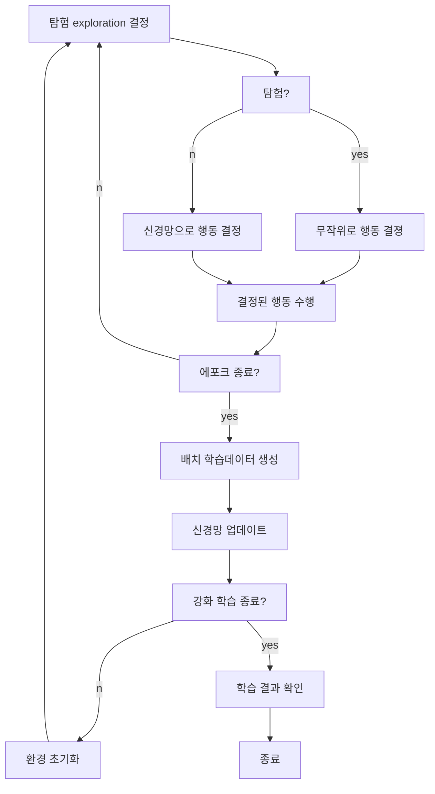

## 1.3 금융 데이터 분석
### 1.3.2 기술적 분석
#### OHLC open-high-low-close
- 주식의 양봉 음봉. 맨날 보는 그거

#### 보조지표
##### 이동평균선(MA, moving average)
- 윈도우 동안 평균 주가의 시계열
- MA(t) = (sigma(x(t - w + i))) / w
    - w : 윈도우
    - x(t) : 차트상의 t번쨰 주가

##### 지수이동평균선(EMA, exponential moving average)
- 최근 가격에 가중치를 둔 이동평균선

##### 볼린저밴드(Bolinger band)
- 주가의 이동평군선을 중심으로 표준편차의 범위를 표시.
- S(t) = sqrt((sigma(x(t-w+i) - MA(t))) / (w - 1))
- UBB : 상한선
- LBB : 하한선

##### *이동평균 수렴 확산(MACD, moving average convergence divergence)
- 2개의 장단기 지수이동평균선으로 모멘텀을 추정하는 보조지표.
- EMA12를 단기선으로, EMA26을 장기선으로 사용
- MACD(t) = EMAs(t) - EMAl(t)
- MACD_signal(t) = EMAn(t) where x(t) = MACD(t)
- MCAD선이 시그널 선을 상향 돌파하면 매수, 하향 돌파하면 매도 사인으로 생각.

##### 상대강도지수 (relative strength index, RSI)
- 과매수, 침체 국면을 판단하는 보조지표
- RSI 70 이상이면 과열, 30 이하면 침체 구간으로 봄

#### 차트 패턴
- Three Line Strike
- Two Black Gapping
- Three Black Cows
- Evening Star
- Abandoned Baby

### 1.3.3 정서 분석
- 투자자들의 정서를 판단하기 위한 분석 방법

## 1.4 전통적인 퀀트 투자

# 4
### 4.1.4 거래 수수료와 거래세
- 매수 수수료 0.015% (최소 150원)
- 매도 수수료 0.015% (최소 150원)
- 거래세 0.25% (최소 2500원)

## 4.2 강화학습 효과를 차별화하는 요인들
### 4.2.1 학습 데이터 구성
- PER (주가수익비율 Price Earning Ratio) = 주가/주당순이익
    - PER이 낮을수록 회사의 순이익에 비해 주가가 저평가되어있다고 봄.
    - 업종마다 평균 PER이 달라서 절대적 판단 기준은 X
- PBR (주가순자산비율 Price Book-value Ratio) = 주가/주당순자산
    - 자산 대비 주가의 비율. PBR이 낮을수록 회사의 가치 대비 주가가 낮다는 의미(저평가)
- ROE (자기자본이익률 Return of Equity)
    - ROE가 높을수록 자산 대비 이익이 크다. > 성장 가능성이 높다.

- 전일 종가 대비 시가 비율 (open/last close)
- 당일 종가 대비 당일 고가 비율 (high/close)
- 당일 종가 대비 당일 저가 비율 (low/close)
- 당일 종가 대비 전일 종가 비율 (close/last close)
- 전일 거래량 대비 당일 거래량 비율 (volume/last volume)
- 5일 평균 종가 대비 당일 종가 비율 (close/MA5 close)
- 10일 평균 종가 대비 당일 종가 비율 (close/MA10 close)
- 20일 평균 종가 대비 당일 종가 비율 (close/MA20 close) -> 주가 추세를 잘 보여주는 이동평균선
- 60일 평균 종가 대비 당일 종가 비율 (close/MA60 close) 
    - 대표적인 이동평균선. 20일선이 60일선을 상향돌파하면 골든 크로스(golden cross)라고 부를 정도
- 120일 그거 (close/MA120 close)

- 5일 평균 거래량 대비 당일 거래량 비율(volume/MA5 volume)
    - 주가가 상승하는데 거래량이 늘고있다면 주가가 더 상승할 가능성 多
    - 주가가 하락하는데 거래량이 늘고있다면 주가가 더 떨어질 가능성 多
- 10일 ''
- 20일 ''
- 60일 ''
- 120일 ''

KOSPI 관련
- 코스피 지수의 (5 ~ 120)일 평균 종가 대비 당일 조가 비율(close/MA5 close)
    - 시장 자체의 단기 방향성을 판단 가능

국채 데이터
- 3년 국채의 (5 ~ 120)일 평균 종가 대비 당일 종가 비율(close/MA5 close)
    - 채권의 방향성.
    - 이론적으로 국채는 주가의 방향성과 반대로 움직임.

### 4.2.2 에이전트 상태 종류
- 현금 잔고
- 보유 주식 수
- 포트폴리오 가치
- 주당 매수 단가
- 매수, 매도, 관망 횟수
- 연속 매수 횟수
- 연속 매도 횟수
- 연속 관망 횟수
- 포트폴리오 가치 대비 매매 비용
등등 다양한 상태 데이터를 사영할 수 있음.

### 4.2.3 에이전트 행동 종류
공격적 매수, 방어적 매수 등등.

### 4.2.4 신경망
어떤 신경망을 쓰느냐

### 4.2.5 강화학습 기법
어떤 기법을 쓰느냐

## 4.4 주식투자 강화학습 절차
### 4.4.1 주식투자 강화학습 순서도

- 학습 데이터를 전부 대상으로 한 차례 반복하는 과정을 에포크(epoch)라고 함

### 4.4.2 행동 결정
한 에포크에서 경험을 얻기 위해 무작위로 행동을 해봐야 함. 이를 탐험(exploration)이라고 함.
일반적으로 강화학습 초반에는 탐험을 많이 하고, 후반으로 갈수록 탐험을 적게 함.

- 입실론 : 탐험 비율
1에포크에서는 입실론이 50퍼, 100에포크에서는  0이 되도록 하는 식.

### 4.4.4 배치 학습 데이터 생성 및 신경망 업데이트
- 한 에포크가 종료되면 이 때 쌓은 경험들로 배치 학습 데이터 생성.
이 학습 데이터ㅗ를 한번에 적용해 신경망을 업데이트. 이런 학습 방법을 batch 학습이라고 부름.

## 4.5 주식투자 강화학습 과정 및 결과 확인 방법
### 4.5.1 필요성
- 강화학습이 잘 되고 있는지 확인해야함.
- 학습 시간은 신경망의 복잡도, 학습 데이터의 크기, 에포크 수에 따라 몇일까지 걸릴 수도 있음.
### 4.5.2 로그로 남기기
#### 파라미터
#### 에포크 결과
#### 최종 학습 결과
### 4.5.4 이미지로 가시화

----

