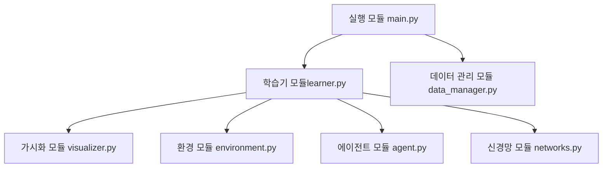

# RLTrader
> 강화학습 기반 주식투자 시스템.

| 소스코드
| https://github.com/quantylab/rltrader/tree/v3.0

## 5.2 RLTrader 설계
### 모듈 구조

### 5.2.3 클래스 다이어그램.

### 5.2.4 환경 모듈 개요
환경 클래스가 존재.
- 에이전트가 투자할 종목의 차트 데이터를 관리.

### 5.2.5 에이전트 모듈 개요
주식을 매수하거나 매도하는 투자자 역할.
상태를 가지고 있음.
- 포트폴리오 가치(PV) = 주식 잔고 * 현재 주가 + 현금 잔고
- 에이전트의 목표는 PV를 높여나가는 것.

### 5.2.6 신경망 모듈 개요
특정 시점의 주식 데이터가 제공되었을 때 매수할지 또는 매도할지를 결정하는 에이전트의 뇌와 같은 역할.
- 가치 신경망 : 주식을 매수/매도했을 때 향후 획득할 수익률 예측
- 정책 신경망 : 매수와 매도에 대한 확률 예측

### 5.2.7 학습기 모듈 개요
- 주요 강화학습 기법을 적용한 학습기 클래스 존재.
- 보상이 결정됐을 때 학습 데이터로 신경망을 학습시킴.

### 5.2.8 데이터 관리 모듈 개요
- 강화 학습을 위해 차트 데이터를 불러오기 위한 함수와 학습 데이터 생성을 위한 전처리 함수.

### 5.2.9 가시화 모듈 개요
- 학습 과정을 직관적으로 파악하기 위한 놈.

### 5.2.10 실행 모듈 개요
- main.py

---

## 5.3 환경 모듈

## 5.4 에이전트 모듈
- STATE_DIM
    - 에이전트 상태의 차원
    - RLTrader에서는 주식 보유 비율, 현재 손익, 평균 매수 단가 대비 등락률 -> 3개 사용

실제 주식 투자에서 거래 수수료와 거래세는 수익성을 좌우하는 큰 요소.
RLTrader의 시뮬레이션은 매일 주식을 매매하여 거래 횟수가 아주 많은데, 이는 좋은 방법이 아니긴 함.

